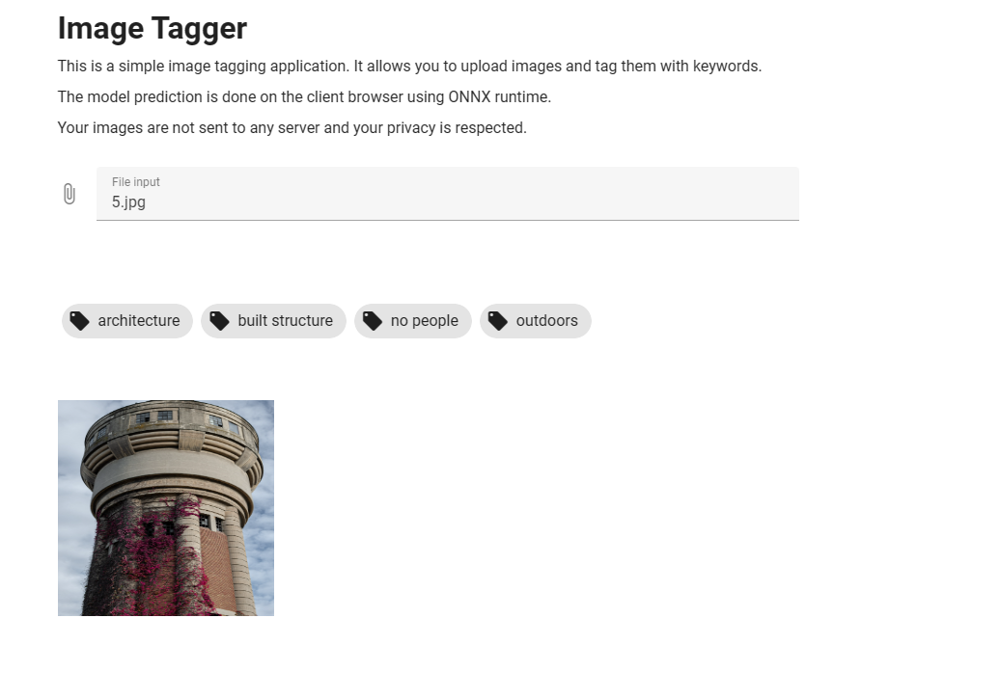

# Image Tagger Vue

This project is a simple Vue.JS application that allows you to use a deep learning model for predicting an image tags.

The model is based on resnet34 due to GitHub size limits and it was trained with FastAI. The model runs on the browser.

To view this project, please visit: https://beautiful-tartufo-6d25b3.netlify.app/

